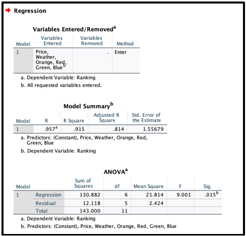

# BEST MONTH TO VISIT DISNEYLAND

# 📌 Project Background 

Imagine a place where fairy tales come to life, where adventure awaits around every corner, and where the magic of childhood dreams becomes a reality.
Disneyland is a place that represents all of those things, where its characters have an uncanny ability to transform our childhoods into something truly magical.
Whether it's the warm embrace of Mickey Mouse, the mischievous antics of Goofy, or the regal grace of Cinderella, these characters bring the stories we grew up with to life in the most enchanting way.
Every year millions of people visit Disneyland. It gets very difficult for people to choose an ideal time to visit the theme park considering the factors of their concern.
The potential to end up going on crowded days or waiting in long queues is always present. So it's important to do an analysis and find an ideal time because each factor has different best timings.
Throughout this project, we'll unveil the secrets of how one can choose the best month to visit Disneyland considering both single-day and multi-day ticket options.

  

<i>In collaboration with Fazil Ahmed, Richa Kapuskari, Shri Hari Sekar, Ziyue Zhang.</i>  

# 📊 Exploratory Data Analysis
## 1. Price
Price is one of the first factors someone considers when visiting any destination, and Disneyland is no exception to this. Knowing price data from the past can help people manage their budget and expectations for an upcoming trip. Visitors will have the ability to save money and choose to purchase additional items in the theme park or maybe even spend more time enjoying the experience rather than increasing their stress in regard to costs. Therefore, price was chosen as the initial factor to begin our analysis.
In our process, we collected the single-day data of prices from January 2023 to December 2023, these prices were taken directly from Disneyland’s website “https://disneyland.disney.go.com”. Based on the data we calculated the average, minimum, and maximum trends for the whole year. The results are shown in the below image. After analyzing the chart, August and September have the best prices to visit Disneyland with a minimum price of around $104 and an average of around $130. With that taken into account, it can be suggested that when only considering price August is the best month to visit with September coming in as the second best.
However, price data only captures one of the initial elements we chose to identify. What if someone wants to maximize the amount of activities they can complete in a single day, or what if the idea of waiting in a long line is completely unacceptable and a visitor wants to avoid it at all costs? In that case, taking a look at crowd traffic data at Disneyland might be a better course of action.
    
      
    
## 2. Crowd
Crowd traffic was one of the most significant factors we considered in regard to identifying the best time to visit Disneyland. For our study, we wanted to pose the question from the perspective of those who might be visiting Southern California for the first time and want the opportunity to visit Disneyland with the best conditions. As most of our cohort consists of international students and others from abroad, crowd traffic plays an important role in the amount of activities an individual can accomplish in a single day. As such it can be assumed that if there are fewer visitors in a given month your likelihood of being able to go on more rides, see more of the park, and overall increase the value of your ticket goes up tremendously.
For the analysis regarding crowd traffic in Disneyland, we compiled every data point for every single day dating from January 1, 2019, to August 26, 2023. The data we obtained was compiled from the website ‘https://www.isitpacked.com’. The data points were listed in the format of Red, Orange, Blue, and Green. Each color represents the amount of traffic that specific day received. We totaled the averages of each color for each month and then divided it by the total number of days in each given month that we had data for. This resulted in having the percentage of foot traffic for every month dating back to 2019.

As can be seen in the below image in our references section. Looking at this data, the initial determination seems to be that September is the best month to visit Disneyland if the single factor you are weighing is crowd traffic, with January coming in as the second-best month.
    
      
      

## 3. Weather
The final independent variable we chose to analyze when considering a single-day ticket was the weather. Weather condition analysis is crucial when planning a visit to Disneyland in Anaheim for several reasons. Anaheim enjoys a Mediterranean climate with mild, wet winters and hot, dry summers. During the summer months, temperatures can soar, making it essential to avoid excessive heat and sun exposure, especially for families with young children or elderly individuals. Rain can disrupt outdoor rides and entertainment, potentially leading to ride closures and the cancellation of outdoor shows and parades. Visitors can choose the most pleasant time to experience the outdoor attractions at the theme park by researching the weather beforehand. It also helps visitors prepare by packing appropriate clothing, such as rain gear or sun protection, to ensure they are comfortable throughout the day. Lastly, safety is a paramount concern when visiting Disneyland. Extreme weather conditions, such as thunderstorms or high winds, can lead to temporary park closures for guest safety and there are chances that people visiting Disneyland would miss out on a few rides of their choice.

Weather data from 2017 to 2023 was taken into account to find the best month. The data was taken from the ‘https://weatherspark.com’ website. The most favorable temperature is 70 degrees Fahrenheit. Looking at the mean historical temperatures across a month we can see in the below image that the best month when considering weather seems to be June, where it isn’t too cold, but during the day might still be hot enough to enjoy a water ride like Splash Mountain. After June, one can also consider October since its average lies around 70 degrees.
In conclusion, weather condition analysis is a crucial step in planning a visit to Disneyland in Anaheim. By staying informed about the weather forecast visitors can optimize their trip and make the most of their time at the magical world of Disneyland. With all of the variables analyzed and considered we can now combine them into a singular analysis and figure out what might be the best month to visit Disneyland.
    
      
    
   
# 🔍 Linear Regression using SPSS
The approach we took to identify the best month to visit Disneyland involved running a linear regression analysis based on all the factors we have talked about up until now. The analysis is only targeting an individual month with the expectation that single-day tickets will be purchased. One additional factor to consider is that since the crowd data itself is not categorized in a numeric value, how were we able to actually add the data into SPSS to properly run a regression? Taking a look at the below image in every column listed with a color you can see that we chose to take the averages listed for each month and then multiply it by a weighted factor. For Red, the factor was 4 points, Orange 3 points, Blue 2 points, and Green 1 point. We then collected the results of these new weighted averages and compiled them into the respective cells to be used as independent variables for the Linear Regression we ran.
    
      
    

We set the dependent variable as ‘Ticket Prices’ for our regression. This was done to verify if our results were related in any way. Weather was added in as an additional independent variable because Disney can’t influence the weather. Finally, the weighted averages of crowd traffic were added in as an independent variable for every month on which we recorded the data. With all of the data points in place, we were able to run a regression and see if there was a correlation between pricing, crowd traffic, and weather data.

The resulting value of R square was 0.89 as shown in the below image. This was a good result because it validated our hypothesis that pricing does correlate to factors such as crowd traffic and may also be planned out in advance in regard to traditional weather patterns. 
    
      
    

However, we were not necessarily trying to identify future prices of tickets in our study. So after verifying these results we once again ran another linear regression, this time setting the Dependent Variable as an ‘Expected Ranking’ of what the ‘best’ months to visit Disneyland are. We considered pricing as the primary weight factor but also looked at crowd traffic and finally weather patterns to determine our rankings. All of these were added in as independent variables this time, with the dependent variable being our own expected rankings. The result of this can be seen in ‘Figure G. With September being listed as the best month and October being listed as the worst, our regression yielded an R-squared value of ‘0.915’ a value even above the initial regression we ran. This helped us validate our current hypothesis that September is the best month to visit and further strengthened the data we have collected.
    
      
    

# 👣 Additional factor
## Disneyland Festivals
In addition to considering the crowds, prices, and climate for a trip to Disneyland, some travelers prefer to visit Disneyland during the festival season. Fortunately, Disney offers a convenient five-day ticket at a fixed price of $85 per day, allowing visitors to use them during a two-week period. During peak times like December or October, single-day tickets typically cost $161 or $169, respectively. This 5-day ticket option greatly improves affordability for visitors.

From September 1 through October 31, 2023, Disneyland will begin celebrating the ‘Halloween Season’ which includes visits from hand-carved pumpkins and beloved Disney characters. From November 10, 2023, to January 7, 2024, Disneyland's celebration of ‘Christmas and the New Year’ will begin. Beyond that, from January 11 to 14, 2024, Disneyland will host a ‘Half Marathon’, welcoming people to participate in three endurance events and various challenges. Based on the duration of these festivals, guests can plan a five-day ticket experience, with the decision of final choice depending on personal preference of festivals. In conclusion, for Disney fans with the ability to visit the park over multiple days, a visit from ‘November’ through ‘January’ is the perfect time to immerse themselves in these exciting festivals.

# 🔑 Key Takeaways    
Throughout this report, we have shown that when considering each independent variable of ticket pricing, crowd traffic, and weather conditions, deciding the single best month might lead to varying results. Because of this, we decided to run a linear regression and demonstrate that when looking at these 3 factors the single best month to visit is 'September’. However, we decided to also consider that there might be some who have extra time available to them and can go to Disneyland multiple times over a two-week period. For these participants, a range from anywhere between ‘November’ and ‘January’ is the most optimal time to visit as not only will they get the best value cost-wise, but the amount of holiday-centric events they can experience goes up as well. 

__<i> According to the data and the analysis, it shows that September is the best month for visiting Disneyland based on factors like ticket prices, crowd, and weather data with an accuracy of R square 0.915 and  alpha=0.05 level of significance. </i>__

# ☁️ Project Challenges
We did face some limitations while analyzing the problem statement. The crowd data was not numeric but we managed to convert the data using weighted factors and obtained a good fit result. Another major challenge was combining three very different factors together and getting one single month as the best month.
